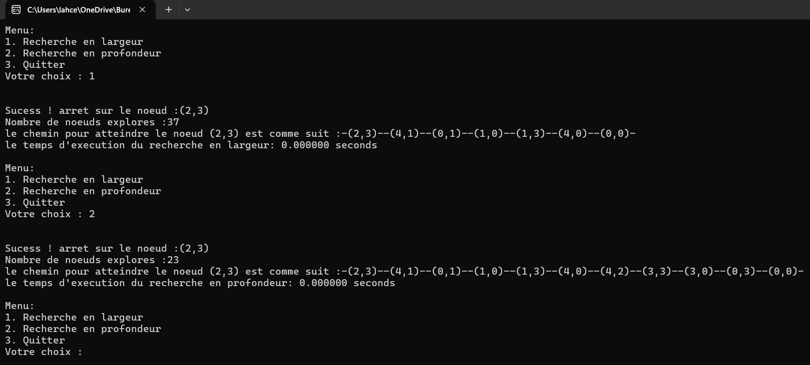

# Problème des Cruches d'Eau

Ce dépôt contient une implémentation du célèbre problème des cruches d'eau avec une approche algorithmique optimisée et une analyse détaillée.

## Contenu du dépôt

1. **Exécutable**  
   - Vous trouverez le fichier `.exe` de l'application dans le dossier :  
     `bin/debug`.

2. **Résultat**  
   - Une image illustrant un exemple de résultat d'exécution du programme est incluse dans le dépôt.

---

### **Exemple de résultat**

---

### **Comment exécuter l'application ?**

1. Accédez au dossier `bin/debug`.
2. Lancez le fichier `.exe`.

